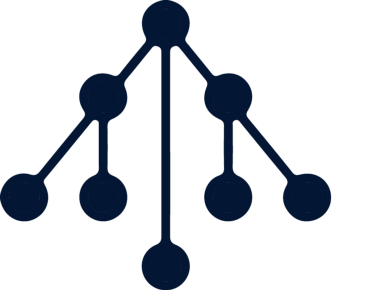

# Interactive Crowdsale Audit


 

<!-- MarkdownTOC -->
* [1 Introduction](#1-introduction)
  * [1.1 Audit Dashboard](#11-audit-dashboard)
  * [1.2 Audit Goals](#12-audit-goals)
  * [1.3 Key Observations/Recommendations](#13-key-observationsrecommendations)
  * [1.4 Overview of Smart Contract System](#14-overview-of-smart-contract-system)
  * [1.5 Scope](#15-scope)
  * [1.6 Issue Remediation](#16-issue-remediation)
  * [1.7 Documentation](#17-documentation)
* [2 Issue Overview](#2-issue-overview)
* [3 Issue Detail](#3-issue-detail)
  * [3.1 CrowdsaleLib::mintToken() allows creation of new tokens after the crowd sale ended](#31-crowdsalelibminttoken-allows-creation-of-new-tokens-after-the-crowd-sale-ended)
  * [3.2 Non-exhaustive test coverage](#32-non-exhaustive-test-coverage)
  * [3.3 Unclear specifications around token sale stages](#33-unclear-specifications-around-token-sale-stages)
  * [3.4 Code is imported by copying and pasting](#34-code-is-imported-by-copying-and-pasting)
  * [3.5 Visibility of functions is not according to security best practices](#35-visibility-of-functions-is-not-according-to-security-best-practices)
  * [3.6 Inconsistent use of Safe Math functions](#36-inconsistent-use-of-safe-math-functions)
  * [3.7 Excess friction using the libraries](#37-excess-friction-using-the-libraries)
  * [3.8 Incomplete documentation and procedures](#38-incomplete-documentation-and-procedures)
  * [3.9 InteractiveCrowdsaleLib - Integer underflow](#39-interactivecrowdsalelib---integer-underflow)
  * [3.10 Array256Lib - Integer underflow](#310-array256lib---integer-underflow)
  * [3.11 Incorrect checks for contract owner ETH withdrawal](#311-incorrect-checks-for-contract-owner-eth-withdrawal)
  * [3.12 Extraneous constructor variables in InteractiveCrowdsaleTestContract](#312-extraneous-constructor-variables-in-interactivecrowdsaletestcontract)
  * [3.13 InteractiveCrowdsaleLib::setCanceled() always returns true](#313-interactivecrowdsalelibsetcanceled-always-returns-true)
  * [3.14 Incorrect use of CrowdsaleLib::crowdsaleEnded()](#314-incorrect-use-of-crowdsalelibcrowdsaleended)
* [4 Threat Model](#4-threat-model)
  * [4.1 Overview](#41-overview)
  * [4.2  InteractiveCrowdSaleTestContract / CrowdSaleToken](#42--interactivecrowdsaletestcontract--crowdsaletoken)
* [5 Tools](#5-tools)
  * [5.1 Mythril](#51-mythril)
  * [5.2 Solhint](#52-solhint)
* [6 Test Coverage Measurement](#6-test-coverage-measurement)
* [Appendix 1 - Severity](#appendix-1---severity)
  * [A.1.1 - Minor](#a11---minor)
  * [A.1.2 - Medium](#a12---medium)
  * [A.1.3 - Major](#a13---major)
  * [A.1.4 - Critical](#a14---critical)
* [Appendix 2 - Disclaimer](#appendix-2---disclaimer)

<!-- /MarkdownTOC -->

 
## 1 Introduction



ConsenSys Diligence conducted a security audit on Modular's implementation of the Interactive Crowdsale design described in the [Interactive Coin Offerings](https://people.cs.uchicago.edu/~teutsch/papers/ico.pdf) paper by Teutsch and Buterin. 

Modular aims to utilize the functionality provided by Ethereum and Solidity to enable on-chain code re-use. The library code has been tested, documented, and deployed with the purpose of being used in Ethereum smart contracts. 

The audit was conducted with the awareness that the system is intended to safely hold very large sums of funds, and to operate reliably and predictably despite adversarial conditions. 

### 1.1 Audit Dashboard

________________

 

#### Audit Details
* **Project Name:** Interactive Crowdsale Audit
* **Client Name:** Modular 
* **Client Contact:** Christopher Brown, Joshua Hannan
* **Auditors:** Gerhard Wagner, John Mardlin
* **GitHub :** https://github.com/Modular-Network/ethereum-libraries/tree/master/CrowdsaleLib/IICOLib
* **Languages:** Solidity, Solidity Assembly
* **Date:** 9th February - 9th of March 2018

#### Number of issues per severity


|  |   |  |  | 
|:-------------:|:-------------:|:-------------:|:-------------:|
| **2**  |  **11**  | **1**  | **0** |

________________

### 1.2 Audit Goals

The focus of the audit was to verify that the smart contract system is secure, resilient and working according to its specifications. The audit activities can be grouped in the following three categories:  

**Security:**
Identifying security related issues within each contract and within the system of contracts.

**Sound Architecture:**
Evaluation of the architecture of this system through the lens of established smart contract best practices and general software best practices.

**Code Correctness and Quality:**
A full review of the contract source code. The primary areas of focus include:

* Correctness 
* Readability 
* Sections of code with high complexity
* Improving scalability
* Quantity and quality of test coverage

### 1.3 Key Observations/Recommendations  

The technical challenge of securely implementing this novel system is impressive, and the work is of high quality. In particular:

*  The design of the system is well documented
*  The code contains many helpful comments
*  The library architecture is efficient, and innovative

With consideration to the level of security required by this system, the following key observations and recommendations are taken from our review:

* **Test coverage is incomplete:** Any contract system that is used on the main net should have as a minimum requirement a 100% test coverage.
* **Include negative test cases:** The majority of the tests are positive test cases, meaning that the tests confirm that the system works with an expected sequence of actions and inputs. The test suite should be expanded to include more negative scenarios to ensure that the safe checks within the contract system are working correctly. 
* **Redesign visibility of functions:** Any implementing contract should only interface with `InteractiveCrowdsaleLib` directly and not with any of the other libraries. Documentation should warn users not to use any of the other libraries directly as this could introduce vulnerabilities in their implementation. The visibility of functions should be restricted as an additional measure to make it clear that `InteractiveCrowdsaleLib` is the API layer interface that should be used when implementing a crowd sale system. 
* **High Complexity:** The multiple library system is complex in nature. Additional complexity is added by having two structs; `InteractiveCrowdsaleStorage` and `CrowdsaleStorage` in separate data structures. 
* **Stages of crowd sale:**  The crowd sale stages and various timings should be defined more clearly in separated control functions. Any state changing function that is called should check first against those control functions and check if it is allowed to be executed. 
* **Fix all findings:** It is recommended to fix all the findings listed in the below chapters, at the very least the ones with severity Critical, Major and Medium. All findings have also been created as issues on [Github](https://github.com/ConsenSys/IICO_repo/issues).

### 1.4 Overview of Smart Contract System
The Interactive Crowd Sale libraries developed by Modular aim to provide the following two properties for a token sale: 

* A fixed amount of currency buys at least a fixed fraction of the total
tokens
* Everyone can participate

The token sale is staged over several time periods that attempts to satisfy the above mentioned properties. An overview of the mechanics of the contract system is shown in the figure below. More detailed information on the `InteractiveCrowdsaleLib` can be found in the white paper and the Github project page (see also chapter 2.4).


### 1.5 Scope 

The source code being audited was retrieved from the [**Modular-Network** repository](https://github.com/Modular-Network/ethereum-libraries/) under the **Modular-Network** Github account. A separate branch `audits` was created for the audit with the latest commit hash `73abc22623e0841b8ea67a5089002f4867102672 `.

The smart contracts in scope of the audit can be found in the [InteractiveCrowdsaleLib](https://github.com/Modular-Network/ethereum-libraries/tree/audits/CrowdsaleLib) directory and are also listed in the below table. 

| Contract Name     | Filename | File Hash |
| ------------- | ---------------| ---------------| 
| Array256Lib | Array256Lib.sol | ee84c0b57848603dfe1b3ceae2d129a3cd0a60d3 |
| BasicMathLib | BasicMathLib.sol | 8c4fb2d732699c7f62fbae44673b5be4b5b6f97c |
| CrowdsaleLib | CrowdsaleLib.sol | a0d874dad8d0675d6e98bfc6ce4f60607e114a7d |
| CrowdsaleToken | CrowdsaleToken.sol | 784ee368986d7e1d3c3d00b80719cd01e4167233 |
| InteractiveCrowdsaleLib | InteractiveCrowdsaleLib.sol | 8c9a0d36836b14b080a8686cd1945ef2484144a0 |
| InteractiveCrowdsaleTestContract | InteractiveCrowdsaleTestContract.sol | d02a26d62dd9c5fefd43d4dd88b7b87cacf49f37 |
| LinkedListLib | LinkedListLib.sol | 206527e03a5a4d35ff51947bbb8e0661db0121a7 |
| TokenLib | TokenLib.sol | 9e353de1286d4ef05f10c63e3ce5c13a1fbc6918 |

**Any other sub projects in the repository were not considered during the audit and are out of scope.**

### 1.6 Issue Remediation  

The majority of the issues found during the audit have been fixed and verified to be closed during the regression phase. The pull requests contained both direct remediation for the issues found and also general improvements to the code base that especially reduced the complexity of the system. The following is a list of pull requests that have been proposed as part of the audit.

| PR title  | Link | 
| ------------- | ---------------| 
| Fix stage specifications | [pull-request/25](https://github.com/ConsenSys/IICO_repo/pull/25) |
| Fix crowdsale ended | [pull-request/24](https://github.com/ConsenSys/IICO_repo/pull/24) |
| Add safe math | [pull-request/23](https://github.com/ConsenSys/IICO_repo/pull/23) |
| issue-7 | [pull-request/22](https://github.com/ConsenSys/IICO_repo/pull/22) |
| Fix set canceled | [pull-request/21](https://github.com/ConsenSys/IICO_repo/pull/21) |
| issues-13-3-9 | [pull-request/20](https://github.com/ConsenSys/IICO_repo/pull/20) |

### 1.7 Documentation

The following documentation was available to the review team:

* The [README](https://github.com/Modular-Network/ethereum-libraries/blob/audits/CrowdsaleLib/IICOLib/README.md) with detailed description about the mechanics of the crowd sale.
* The [White Paper](https://people.cs.uchicago.edu/~teutsch/papers/ico.pdf) explaining the concept behind interactive token crowd sales. 

## 2 Issue Overview 

The following table contains all the issues discovered during the audit. The issues are ordered based on their severity. More detailed description on the  levels of severity can be found in Appendix 2. The table also contains the Github status of any discovered issue.

| Chapter | Issue Title  | GitHub Repo | Severity |
| ------------- | ------------- | ------------- | ------------- |
| 3.1 | [CrowdsaleLib::mintToken() allows creation of new tokens after the crowd sale ended](#31-crowdsalelibminttoken-allows-creation-of-new-tokens-after-the-crowd-sale-ended) | [IICO-audit-repo](https://github.com/ConsenSys/IICO_repo/tree/audits/CrowdsaleLib/IICOLib) |  |  
| 3.2 | [Non-exhaustive test coverage](#32-non-exhaustive-test-coverage) | [IICO-audit-repo](https://github.com/ConsenSys/IICO_repo/tree/audits/CrowdsaleLib/IICOLib) |  |  
| 3.3 | [Unclear specifications around token sale stages](#33-unclear-specifications-around-token-sale-stages)  | [IICO-audit-repo](https://github.com/ConsenSys/IICO_repo/tree/audits/CrowdsaleLib/IICOLib) |  |  
| 3.4 | [Code is imported by copying and pasting](#34-code-is-imported-by-copying-and-pasting) | [IICO-audit-repo](https://github.com/ConsenSys/IICO_repo/tree/audits/CrowdsaleLib/IICOLib) |  |  
| 3.5 | [Visibility of functions is not according to security best practices](#35-visibility-of-functions-is-not-according-to-security-best-practices) | [IICO-audit-repo](https://github.com/ConsenSys/IICO_repo/tree/audits/CrowdsaleLib/IICOLib) |  |  
| 3.6 | [Inconsistent use of Safe Math functions](#36-inconsistent-use-of-safe-math-functions) | [IICO-audit-repo](https://github.com/ConsenSys/IICO_repo/tree/audits/CrowdsaleLib/IICOLib) |  |  
| 3.7 | [Excess friction using the libraries](#37-excess-friction-using-the-libraries) | [IICO-audit-repo](https://github.com/ConsenSys/IICO_repo/tree/audits/CrowdsaleLib/IICOLib) |  |  
| 3.8 | [Incomplete documentation and procedures](#38-incomplete-documentation-and-procedures) | [IICO-audit-repo](https://github.com/ConsenSys/IICO_repo/tree/audits/CrowdsaleLib/IICOLib) |  |  
| 3.9 | [InteractiveCrowdsaleLib - Integer underflow](#39-interactivecrowdsalelib---integer-underflow) | [IICO-audit-repo](https://github.com/ConsenSys/IICO_repo/tree/audits/CrowdsaleLib/IICOLib) |  |  
| 3.10 | [Array256Lib - Integer underflow](#310-array256lib---integer-underflow) | [IICO-audit-repo](https://github.com/ConsenSys/IICO_repo/tree/audits/CrowdsaleLib/IICOLib) |  |  
| 3.11 | [Incorrect checks for contract owner ETH withdrawal](#311-incorrect-checks-for-contract-owner-eth-withdrawal) | [IICO-audit-repo](https://github.com/ConsenSys/IICO_repo/tree/audits/CrowdsaleLib/IICOLib) |  |  
| 3.12 | [Extraneous constructor variables in InteractiveCrowdsaleTestContract](#312-extraneous-constructor-variables-in-interactivecrowdsaletestcontract) | [IICO-audit-repo](https://github.com/ConsenSys/IICO_repo/tree/audits/CrowdsaleLib/IICOLib) |  |  
| 3.13 | [InteractiveCrowdsaleLib::setCanceled() always returns true](#313-interactivecrowdsalelibsetcanceled-always-returns-true) | [IICO-audit-repo](https://github.com/ConsenSys/IICO_repo/tree/audits/CrowdsaleLib/IICOLib) |  |  
| 3.14 |  [Incorrect use of CrowdsaleLib::crowdsaleEnded()](#314-incorrect-use-of-crowdsalelibcrowdsaleended) | [IICO-audit-repo](https://github.com/ConsenSys/IICO_repo/tree/audits/CrowdsaleLib/IICOLib) |  |  


## 3 Issue Detail

### 3.1 CrowdsaleLib::mintToken() allows creation of new tokens after the crowd sale ended

| Severity  | Issue State | GitHub Repo | Issue Link |
| ------------- | ------------- | ------------- | ------------- |
|  |   | [IICO-audit-repo](https://github.com/ConsenSys/IICO_repo/tree/audits/CrowdsaleLib/IICOLib) | [ issues/9](https://github.com/ConsenSys/IICO_repo/issues/9) |

#### Description 
The `TokenLib` library allows the contract owner to create an arbitrary amount of tokens after the crowd sale has ended. This option for the contract owner to create new tokens contradicts with the objective to create a fair token sale for users that allows them to buy tokens at a valuation of their choosing.


```Solidity   
  function mintToken(TokenStorage storage self, uint256 _amount) public returns (bool) {
    require((self.owner == msg.sender) && self.stillMinting);
    uint256 _newAmount;
    bool err;

    (err, _newAmount) = self.totalSupply.plus(_amount);
    require(!err);

    self.totalSupply =  _newAmount;
    self.balances[self.owner] = self.balances[self.owner] + _amount;
    Transfer(0x0, self.owner, _amount);
    return true;
  }
```

[Github Code Link](https://github.com/ConsenSys/IICO_repo/blob/910fc4b77301ff6f53fe2cb224846ede7d1fab8b/CrowdsaleLib/IICOLib/truffle/contracts/TokenLib.sol#L216-L228)

The configuration option is available during the initialization of the token sale itself through the `allowMinting` parameter. 

```Solidity
      const IICO = await deployer.deploy(InteractiveCrowdsaleTestContract,
        accounts[0],
        purchaseData, // saleData, 
        10, // priceBonusPercent,
        100, // minimumRaise,
        endWithdrawalTime, // endWithdrawalTime,
        endTime, // endTime,
        50, // percentBeingSold,
        "Tester Token", // tokenName,
        "TST", // tokenSymbol,
        18, // tokenDecimals,
        false // allowMinting);
      );
```

#### Recommendation
It is recommended to remove the `mintToken()` function from the contract system as this allows a contract owner to create an arbitrary amount of new tokens. 


### 3.2 Non-exhaustive test coverage

| Severity  | Issue State | GitHub Repo | Issue Link |
| ------------- | ------------- | ------------- | ------------- |
|  |   | [IICO-audit-repo](https://github.com/ConsenSys/IICO_repo/tree/audits/CrowdsaleLib/IICOLib) | [ issues/10](https://github.com/ConsenSys/IICO_repo/issues/10) |

#### Description 

A test suite should be comprehensive and as a minimum requirement provide 100% coverage. This is best practice for smart contact systems as it ensures that every code path has been at least once been executed during a test run. Also tests should be contextual and well documented and provide the basis for the specifications of the smart contract system. 

The following tests were found to have incomplete flows: 

**Handling a canceled sale** 
Does not test if a user is actually able to withdraw the funds using `withdrawLeftoverWei`. 

**Test cases not included** 

* No tests for stress testing the crowd sale contract system are included. It is recommended to create tests with tens or hundreds of thousands of bids and withdrawals to verify that the contract systems is functional and is working as expected. The tests should also be performed on a public test net if possible. 
* Owner cannot withdraw ETH during any phase prior to the end of the sale. 
* FinalizeSale cannot be called during any phase prior to the end of the sale. 
* The case where `self.totalValuation == self.currentBucket`

In general it was found that the test cases are usually checking for expected flow and hardly ever for negative scenarios. 

#### Recommendation 

1. Ensure 100% test coverage.
2. Implement the missing test cases identified above.
3. Identify and implement other missing test cases.

For step 3, we recommend explicitly specifying what actions and states should not be possible. 
Then implement the tests necessary to confirm.

#### References
- [Smart contract best practices](https://consensys.github.io/smart-contract-best-practices/security_tools/#test-coverage)


### 3.3 Unclear specifications around token sale stages

| Severity  | Issue State | GitHub Repo | Issue Link |
| ------------- | ------------- | ------------- | ------------- |
|  |   | [IICO-audit-repo](https://github.com/ConsenSys/IICO_repo/tree/audits/CrowdsaleLib/IICOLib) | [ issues/14](https://github.com/ConsenSys/IICO_repo/issues/14) |

#### Description 
The crowd sale documentation defines three stages of the crowd sale: first stage, second stage and post sale. Time delimiters for these stages are listed below: 

1. Start of the Sale: `startTime` 
--> first stage <--
2. Time that no withdrawals are possible above cutoff and no bonus applies afterwards `endWithdrawalTime`
--> second stage  <--
3. End of the Sale: `endTime`
--> post sale <--
4. Sale finalized: When a sale is finalized the timing is dynamic as this is initiated by the crowd sale participant. If a sale is successful and raises more than `minimumRaise` then the token is launched else the sale is canceled. 

#### Recommendation
There are two recommendations to provide more clarity around the crowd sale stages: 

* Clearly define which state changing functions should be callable during which stages. Potentially create function modifiers that define the stages.
* `endTime` and the point in time when a sale is finalized are used interchangeably. The correct checks should be applied based on the calling function.


### 3.4 Code is imported by copying and pasting

| Severity  | Issue State | GitHub Repo | Issue Link |
| ------------- | ------------- | ------------- | ------------- |
|  |   | [IICO-audit-repo](https://github.com/ConsenSys/IICO_repo/tree/audits/CrowdsaleLib/IICOLib) | [ issues/18](https://github.com/ConsenSys/IICO_repo/issues/18) |

#### Description

Each of the libraries which the `InteractiveCrowdsaleLib` contract depends on are maintained in separated directories of the repository, where the primary testing and development for each of these libraries is done. It is onerous for a reviewer to ensure that the copied and pasted libraries are identical to the canonical version. 

#### Recommendation

At a minimum, use symbolic linking to include the dependency libraries. Consider using git's submodule feature.


### 3.5 Visibility of functions is not according to security best practices

| Severity  | Issue State | GitHub Repo | Issue Link |
| ------------- | ------------- | ------------- | ------------- |
|  |   | [IICO-audit-repo](https://github.com/ConsenSys/IICO_repo/tree/audits/CrowdsaleLib/IICOLib) | [ issues/3](https://github.com/ConsenSys/IICO_repo/issues/3) |

#### Description 

Specifying the visibility of state variables and functions is an integral part of secure smart contract systems. Declarations should be assigned with the rule in mind that increasing visibility can create a bigger attack surface and can cause actual vulnerabilities that can be exploited by malicious users. 

Also a secure smart contract system has clearly defined visibility for state variables and functions as part of its design. This helps to improve readability and re-usability of code. 

#### Examples

It was found that function visibility is not defined in the most secure way possible. Visibility properties such as public and internal are often used interchangeably in throughout the code base.

Affected contracts/libraries:

```
InteractiveCrowdsaleLib
CrowdsaleLib
TokenLib
```


#### Recommendation

Since this a library for crowd sales, the visibility should be defined in a way that limits the potential for introducing security vulnerabilities during an actual implementation of the `InteractiveCrowdSaleLib` and that makes an on chain deployment of the library reusable. Therefore the following visibility design depicted in the figure below should be adopted for the smart contract system. The arrows symbolize the directive `using for`.


Any crowd sale implementation using `InteractiveCrowdsaleLib` should have only `using for InteractiveCrowdsaleLib.CrowdsaleStorage` and no other libraries as it is currently setup in `InteractiveCrowdsaleTestContract`. 

`InteractiveCrowdsaleLib` will act like an API layer that exposes all necessary functionality through `public` or `external` functions to the contract that uses it, in this case `InteractiveCrowdsaleTestContract`. Developer documentation should explicitly guide users to only directly interface with `InteractiveCrowdsaleLib` and not with any other libraries. Function visibilities should be updated according to the design above.

#### References
- [Smart contract best practices](https://consensys.github.io/smart-contract-best-practices/recommendations/#explicitly-mark-visibility-in-functions-and-state-variables)


### 3.6 Inconsistent use of Safe Math functions

| Severity  | Issue State | GitHub Repo | Issue Link |
| ------------- | ------------- | ------------- | ------------- |
|  |   | [IICO-audit-repo](https://github.com/ConsenSys/IICO_repo/tree/audits/CrowdsaleLib/IICOLib) | [ issues/6](https://github.com/ConsenSys/IICO_repo/issues/6) |

#### Description  

The contract system does not or inconsistently uses safe math library functions for arithmetic calculations. Numbers can overflow or underflow and this can lead to vulnerabilities and bugs in the contract system that could have serious consequences. In more complex contract systems it is almost always safer to use vetted safe math functions. 

It has been found that several potential integer underflows exist in the smart contract system. A consistent use of safe math functions will prevent any potential issue arising from arithmetic calculations. 

#### Recommendation

The `BasicMathLib` that is currently used in some cases, should be used consistently across the entire smart contract system. 

#### References
[Open Zeppelin SafeMath](https://github.com/OpenZeppelin/zeppelin-solidity/blob/master/contracts/math/SafeMath.sol)
[Dapphub DSMath](https://github.com/dapphub/ds-math/blob/master/src/math.sol)


### 3.7 Excess friction using the libraries

| Severity  | Issue State | GitHub Repo | Issue Link |
| ------------- | ------------- | ------------- | ------------- |
|  |   | [IICO-audit-repo](https://github.com/ConsenSys/IICO_repo/tree/audits/CrowdsaleLib/IICOLib) | [ issues/17](https://github.com/ConsenSys/IICO_repo/issues/17) |

#### Description

Friction should be minimized as it might prevent external collaborators from running, testing, reviewing, and submitting improvements to the code base. It was found to be time consuming to setup a local environment in order to reliably run the test suite or generate code coverage measurements. Additionally, it was not possible in the course of the audit to run the migrations (contract deployment) script without significant changes. They did not appear to have been updated from the basic `CrowdsaleLIb`. 

#### Recommendations

1. NPM environment setup

Users should not need to ensure they have the correct version of truffle install globally. It should be included as a dependency in `package.json`. Dependency versions should be pinned to prevent issues with updates. 

Use [NPM scripts](https://docs.npmjs.com/misc/scripts) to run common commands using local dependencies, ie. `truffle test` becomes `npm run test`, `truffle migrate` become `npm run migrate`. The [ConsenSys Tokens](https://github.com/ConsenSys/Tokens) repo provides a good example on how this can be setup. 


2. Ensure the migrations scripts are working

The time of a contract system deployment provides many opportunities for misconfiguration and human error. A well documented, configurable and easy to use migrations script should be created to support users wishing to use this code in their own projects.


### 3.8 Incomplete documentation and procedures

| Severity  | Issue State | GitHub Repo | Issue Link |
| ------------- | ------------- | ------------- | ------------- |
|  |   | [IICO-audit-repo](https://github.com/ConsenSys/IICO_repo/tree/audits/CrowdsaleLib/IICOLib) | [ issues/5](https://github.com/ConsenSys/IICO_repo/issues/5) |

#### Description 

Detailed and accurate documentation and procedures of smart contract systems is essential for all stages of software development as it gives guidance on the intended behavior and recommended usage of a given system. This is especially meaningful in more complex systems as it provides an abstraction layer above the code itself and helps team members and users a like to understand the source code and its intent faster and more accurately. 

#### Recommendation

The review found a lack of documentation and procedures in the following areas:

* The `finalizeSale()` function can be called by anyone after the sale ends and if the sale has not been canceled. The function also triggers `launchToken()` which deploys a new token contract. This gives every participant the right to finalize the sale according to the parameters set during the launch of the crowd sale.  This is an essential design component of the `InteractiveCrowdSaleLib` and it should be highlighted as such. 

* `retreiveFinalResult`has a typo in the function name. 

* `retreiveFinalResult` can be called by any crowd sale participant after sale has ended, yet comments in the code indicate that the owner has to finalize the sale and withdraw his Ether before it can be called.  

* `submitBid` make it clear that a crowd sale participant can only make one bid per address and not multiple. 

#### References
- [Smart contract best practices](https://consensys.github.io/smart-contract-best-practices/documentation_procedures/)


### 3.9 InteractiveCrowdsaleLib - Integer underflow

| Severity  | Issue State | GitHub Repo | Issue Link |
| ------------- | ------------- | ------------- | ------------- |
|  |   | [IICO-audit-repo](https://github.com/ConsenSys/IICO_repo/tree/audits/CrowdsaleLib/IICOLib) | [ issues/8](https://github.com/ConsenSys/IICO_repo/issues/8) |

#### Description 

An overflow/underflow happens when an arithmetic operation reaches the maximum or minimum size of a type. For instance if a number is stored in the `uint8 type`, it means that the number is stored in a 8 bits unsigned number ranging from 0 to 2^8-1. In computer programming, an integer overflow occurs when an arithmetic operation attempts to create a numeric value that is outside of the range that can be represented with a given number of bits – either larger than the maximum or lower than the minimum representable value.

The most common result of an overflow is that the least significant representable bits of the result are stored, meaning the number wraps around the maximum and starts at 0 again. For an underflow it is exactly the opposite way, the number would wrap around minimum. 

```Solidity
unit8 overflow = 255 + 1;   // overflow == 0
unit8 underflow = 0 - 1; // underflow == 255 
```

#### Examples 

The following instances of potential integer overflows have been discovered in the contract system. 

```Solidity
      self.numBidsAtValuation[self.personalCaps[msg.sender]] -= 1;

```

[Github Code Link](https://github.com/ConsenSys/IICO_repo/blob/910fc4b77301ff6f53fe2cb224846ede7d1fab8b/CrowdsaleLib/IICOLib/truffle/contracts/InteractiveCrowdsaleLib.sol#L392)

```Solidity
     self.pricePurchasedAt[msg.sender] = self.pricePurchasedAt[msg.sender] -
                                          ((self.pricePurchasedAt[msg.sender] - self.base.tokensPerEth) / 3);
```

[Github Code Link](https://github.com/ConsenSys/IICO_repo/blob/910fc4b77301ff6f53fe2cb224846ede7d1fab8b/CrowdsaleLib/IICOLib/truffle/contracts/InteractiveCrowdsaleLib.sol#L394)

```Solidity
        self.base.hasContributed[msg.sender] -= refundWei;

```

[Github Code Link](https://github.com/ConsenSys/IICO_repo/blob/910fc4b77301ff6f53fe2cb224846ede7d1fab8b/CrowdsaleLib/IICOLib/truffle/contracts/InteractiveCrowdsaleLib.sol#L405)

```Solidity
      _proposedCommit = self.valueCommitted - refundWei;

```

[Github Code Link](https://github.com/ConsenSys/IICO_repo/blob/910fc4b77301ff6f53fe2cb224846ede7d1fab8b/CrowdsaleLib/IICOLib/truffle/contracts/InteractiveCrowdsaleLib.sol#L419)

#### Recommendation

It is recommended to use vetted safe math libraries for arithmetic operations consistently throughout the smart contract system.  In this case the `BasicMathLib.minus()` function should be used for all instances listed in the Examples chapter.

#### References
- [Smart contract best practices](https://consensys.github.io/smart-contract-best-practices/known_attacks/#integer-overflow-and-underflow)


### 3.10 Array256Lib - Integer underflow

| Severity  | Issue State | GitHub Repo | Issue Link |
| ------------- | ------------- | ------------- | ------------- |
|  |   | [IICO-audit-repo](https://github.com/ConsenSys/IICO_repo/tree/audits/CrowdsaleLib/IICOLib) | [ issues/7](https://github.com/ConsenSys/IICO_repo/issues/7) |

#### Description 

An overflow/underflow occurs when an arithmetic operation reaches the maximum or minimum size of a type. For instance if a number is stored in the `uint8 type`, it means that the number is stored in an 8 bits unsigned number ranging from 0 to 2^8-1. In computer programming, an integer overflow occurs when an arithmetic operation attempts to create a numeric value that is outside of the range that can be represented with a given number of bits – either larger than the maximum or lower than the minimum representable value.

The most common result of an overflow is that the least significant representable bits of the result are stored, meaning the number wraps around the maximum and starts at 0 again. For an underflow it is exactly the opposite way, the number would wrap around minimum. 

```
unit8 overflow = 255 + 1;   // overflow == 0
unit8 underflow = 0 - 1; // underflow == 255 
```

#### Examples 

The `heapSort()` function in `Array256Lib` is vulnerable to an integer underflow. The issue arises when the function is supplied with a `uint256[]` that has zero or one elements only. The `start` and `root` are vulnerable to an integer underflow condition. 

[Github Code Link](https://github.com/ConsenSys/IICO_repo/blob/910fc4b77301ff6f53fe2cb224846ede7d1fab8b/CrowdsaleLib/IICOLib/truffle/contracts/Array256Lib.sol#L149-L160)

To illustrate the issue the`oneElement()` function shown in the below code snippet is called that passes on a one element array to `Array256Lib.heapSort()`. The screen shot shows the remix debugger after the `start` and `root` variable have had underflows. 

```Solidity

contract TestArray {
    using Array256Lib for uint256[];
    
    uint256[] test0 ;
    uint256[] test1 = [1];
    uint256[] test2 = [1,2];
    
    function zeroElement(){
        test0.heapSort();
    }
    
    function oneElement(){
        test1.heapSort();
    }
    
    function twoElement(){
        test2.heapSort();
    }
}
```


#### Recommendation

It is recommended to use vetted safe math libraries for arithmetic operations consistently throughout the smart contract system. Should this not be possible then it is advised to perform proper checks into the code to verify that underflows or overflows are not possible.   

#### References
- [Smart contract best practices](https://consensys.github.io/smart-contract-best-practices/known_attacks/#integer-overflow-and-underflow)


### 3.11 Incorrect checks for contract owner ETH withdrawal

| Severity  | Issue State | GitHub Repo | Issue Link |
| ------------- | ------------- | ------------- | ------------- |
|  |   | [IICO-audit-repo](https://github.com/ConsenSys/IICO_repo/tree/audits/CrowdsaleLib/IICOLib) | [ issues/12](https://github.com/ConsenSys/IICO_repo/issues/12) |

#### Description 

`CrowdSaleLib` performs checks in order to determine if a contract owner can withdraw ETH. The checks are incorrect and not according to best coding practices.

#### Examples 

The `crowdsaleEnded()` only checks if the crowd sale has ended and not finalized. 

The check `self.token.balanceOf(this)>0)` is not according best coding practices, because before the token launch the code will call the contract `CrowdsaleToken` that has not been deployed yet. This will cause an EVM exception and the call is reverted. 

```Solidity
  function withdrawOwnerEth(CrowdsaleStorage storage self) public returns (bool) {
    if ((!crowdsaleEnded(self)) && (self.token.balanceOf(this)>0)) { 
      LogErrorMsg(0, "Cannot withdraw owner ether until after the sale!");
      return false;
    }
```

[Github Code Link](https://github.com/ConsenSys/IICO_repo/blob/910fc4b77301ff6f53fe2cb224846ede7d1fab8b/CrowdsaleLib/IICOLib/truffle/contracts/CrowdsaleLib.sol#L203-L207)

#### Recommendation
Check if the sale has been finalized and only then allow an owner to withdraw funds. 

#### References
- [Smart contract best practices](https://consensys.github.io/smart-contract-best-practices/recommendations/#lock-pragmas-to-specific-compiler-version)

### 3.12 Extraneous constructor variables in InteractiveCrowdsaleTestContract

| Severity  | Issue State | GitHub Repo | Issue Link |
| ------------- | ------------- | ------------- | ------------- |
|  |   | [IICO-audit-repo](https://github.com/ConsenSys/IICO_repo/tree/audits/CrowdsaleLib/IICOLib) | [ issues/13](https://github.com/ConsenSys/IICO_repo/issues/13) |

#### Description

The `InteractiveCrowdsaleTestContract` constructor takes a variable called `saleData`. This is then passed to the `init()` function of `InteractiveCrowdsaleLib` and on to the `CrowdsaleLib`. 

[Github Code Link](https://github.com/ConsenSys/IICO_repo/blob/audits/CrowdsaleLib/IICOLib/truffle/contracts/InteractiveCrowdsaleLib.sol#L152-L154)

These values are not utilized anywhere in the implemented contract, and are a symptom of extra complexity introduced to appease the library based development approach.

### 3.13 InteractiveCrowdsaleLib::setCanceled() always returns true

| Severity  | Issue State | GitHub Repo | Issue Link |
| ------------- | ------------- | ------------- | ------------- |
|  |   | [IICO-audit-repo](https://github.com/ConsenSys/IICO_repo/tree/audits/CrowdsaleLib/IICOLib) | [ issues/4](https://github.com/ConsenSys/IICO_repo/issues/4) |

#### Description 
`setCanceled()` checks if a the crowd sale should be canceled and updates `self.isCanceled` if the condition is true. The function always returns true which decreases readability and is not according to coding best practices.

##### Examples
The source code for `setCanceled()` is shown below. 

```Solidity 
  /// @dev returns a boolean indicating if the sale is canceled.
  ///      This can either be if the minimum raise hasn't been met
  ///      or if it is 30 days after the sale and the owner hasn't finalized the sale.
  /// @return bool canceled indicating if the sale is canceled or not
  function setCanceled(InteractiveCrowdsaleStorage storage self) internal returns(bool){
    bool canceled = (self.totalValuation < self.minimumRaise) ||
                    ((now > (self.base.endTime + 30 days)) && !self.isFinalized);

    if(canceled) {self.isCanceled = true;}

    return true;
  }
```

[Github Code Link](https://github.com/ConsenSys/IICO_repo/blob/c4ddf0cf61d6f255664167711c3a0bd4b832b578/CrowdsaleLib/IICOLib/truffle/contracts/InteractiveCrowdsaleLib.sol#L564-L574)

#### Recommendation
A way to improve the function `setCanceled()` is listed below. It sets `self.isCanceled` if the crowd sale is canceled and also returns the state of the variable `self.isCanceled`. 

```Solidity
    function setCanceled(InteractiveCrowdsaleStorage storage self) internal returns(bool){ 
        if (self.totalValuation < self.minimumRaise) ||  ((now > (self.base.endTime + 30 days)) && !self.isFinalized) {
            if(!self.isCanceled) {
                self.isCanceled = true;
            }
        }
        return self.isCanceled; 
    }
```

It is recommended to refactor the code in `InteractiveCrowdsaleLib` and remove redundant code for instance in the example listed below:

```Solidity 
    if(!self.isFinalized){
      require(setCanceled(self));
      require(self.isCanceled);
    }

    if (self.isCanceled) {
```

[Github Code Link](https://github.com/ConsenSys/IICO_repo/blob/c4ddf0cf61d6f255664167711c3a0bd4b832b578/CrowdsaleLib/IICOLib/truffle/contracts/InteractiveCrowdsaleLib.sol#L589-L594) 

### 3.14 Incorrect use of CrowdsaleLib::crowdsaleEnded()

| Severity  | Issue State | GitHub Repo | Issue Link |
| ------------- | ------------- | ------------- | ------------- |
|  |   | [IICO-audit-repo](https://github.com/ConsenSys/IICO_repo/tree/audits/CrowdsaleLib/IICOLib) | [ issues/11](https://github.com/ConsenSys/IICO_repo/issues/11) |

#### Description 

The `crowdsaleEnded()` function is part of the `CrowdsaleLib` library. It indicates when the crowd sale has ended and checks if `now > self.endTime`. The check is often used to check if a sale is finalized. The timing for when the sale ends and when sale is finalized are not the same but in the library implementation it used interchangeably. 

#### Recommendation
Checks for the timings of the various stages of the crowd sale should be accurate. This will improve readability and also lowers the potential to introduce vulnerabilities resulting from overlapping time periods of the stages. 


## 4 Threat Model

### 4.1 Overview 

The creation of a threat model is beneficial when building smart contract systems as it helps to understand the potential security threats, assess risk, and identify appropriate mitigation strategies. This is especially useful during the design and development of a contract system as it allows to create a more resilient design which is more difficult to change post-development. 

A threat model was created during the audit process in order to analyze the attack surface of the contract system and to focus review and testing efforts on key areas that a malicious actor would likely also attack. It consists of two parts a high level design diagram that help to understand the attack surface and a list of threats that exist for the contract system. 

### 4.2  InteractiveCrowdSaleTestContract / CrowdSaleToken

The following figure shows the high level design diagrams of a fully deployed `InteractiveCrowdSaleLib` contract system and its libraries and highlights its attack surface. 


`InteractiveCrowdSaleTestContract` and `CrowdSaleToken` are the main contracts which link to the rest of the libraries. The functions exposed by these contracts make up the attack surface of the contract system. These functions are additionally divided in two categories: Functions that perform state changes in `InteractiveCrowdsaleStorage` and functions that read state variables and return information only. The threat model is focused on functions that change the state, in which vulnerabilities or bugs would have the greatest impact on the contract system. Read only functions (with visibility `view` or `pure`) are considered in the threat model as well but primarily for the reason that they are themselves called by state changing functions and so can introduce bugs or vulnerabilities to the caller functions.

The following are examples for potential threats to the contract systems:

**A malicious user could attempt to,** 

1. withdraw ETH/tokens to an arbitrary address.  
2. brick the contract so that ETH/tokens are lost forever. 
3. disrupt the two main features of the Crowdsale:
  * everyone can participate  
  * a fixed amount of currency buys at least a fixed fraction of the total tokens
4. game the token Crowdsale in a way that other participants are at a disadvantage during the token sale. 


**A malicious crowd sale owner could attempt to,** 

1. withdraw ETH submitted from participants in case a sale is not successful.
2. create new tokens at will during or after a Crowdsale.
3. withdraw participant's tokens that were sold during a successful Crowdsale.


## 5 Tools


### 5.1 Mythril 


Mythril is a security analysis tool for Ethereum smart contracts. It uses concolic analysis to detect various types of issues. The tool was used for automated vulnerability discovery for all audited contracts and libraries. More details on Mythril's current vulnerability coverage can be found [here](https://github.com/ConsenSys/mythril/blob/master/security_checks.md). 

The raw output of the Mythril vulnerability scan can be found [here](./tools/mythril-truffle-out.txt). 

### 5.2 Solhint 


This is an open source project for linting Solidity code. The project provides both Security and Style Guide validations. The findings of Solhint were analyzed for security relevant findings only. It is still recommended to use Solhint during development to improve code quality while writing smart contracts. 

The raw output of the Solhint vulnerability scan can be found [here](./tools/solhint_security_rules.txt). 

### 5.3 Odyssey 


Odyssey is an audit tool that acts as the glue between developers, auditors and tools. It leverages Github as the platform for building software and aligns to the approach that quality needs to be addressed as early as possible in the development life cycle and small iterative security activities spread out through development help to produce a more secure smart contract system.
In its current version Odyssey helps to better communicate audit issues to development teams and to successfully close them.

## 6 Test Coverage Measurement

Testing is implemented using the Truffle Framework. 44 tests are included in the test suite and they all pass.

```
  Contract: InteractiveCrowdsaleTestContract
    Moving pointer
      ✓ calculates the pointer correctly (11122ms)
      ✓ gives correct ETH refunds during the sale (535ms)
      ✓ denies token withdrawals if owner has not withdrawn ETH yet (159ms)
      ✓ initializes token correctly (166ms)
      ✓ allows correct ETH withdrawals (2006ms)
      ✓ gives full token purchases to bidders above the total valuation (3479ms)
      ✓ correctly splits the token/eth distro for users at the valuation
    Intializing the contract
      ✓ has the correct owner
      ✓ has the correct minimum raise
      ✓ has the correct start time
      ✓ has the correct endWithdrawalTime
      ✓ has the correct endTime
      ✓ initializes with zeroed valuation
      ✓ initializes with no tokens sold
      ✓ has the correct burn percentage
      ✓ has the correct tokens per Eth calculated
      ✓ has the correct active status
    Testing bid submission
      ✓ disallows bid submission if sale hasn't started
      ✓ should accept a bid if the sale has started (238ms)
      ✓ disallows bid submission if bidder previously bid
      ✓ should show the correct personal cap for the bidder
      ✓ should not accept payment in the fallback function
      ✓ should set the valuation to the appropriate bucket (157ms)
      ✓ should include a bid with a personal cap equal to valuation prior to withdrawal lock (104ms)
      ✓ should not include a bid with a personal cap equal to valuation after withdrawal lock (231ms)
    Withdrawing ETH
      ✓ calculates withdraw amount correctly (749ms)
      ✓ accepts a bid with a low cap prior to withdrawal lock (91ms)
      ✓ adjusts the purchase price after withdrawal penalty correctly (502ms)
      ✓ denies eth withdrawal after a previous withdrawal
      ✓ denies eth withdrawal after withdrawal lock if the cap is at or above valuation (417ms)
      ✓ allows a full withdrawal after the lock if the cap is too low
      ✓ allows a bidder to withdraw their wei (55ms)
    Launching the token
      ✓ accepts 100 ETH (756ms)
      ✓ should not have a token before finalization
      ✓ moves to after the end time (177ms)
      ✓ launches the new token when finalized (182ms)
      ✓ launches the correct amount of tokens
      ✓ gives the correct amount of tokens to the owner
      ✓ gives the correct amount of tokens to the contract
      ✓ allows owner to withdraw eth from the sale (44ms)
    Handling a canceled sale
      ✓ should accept a bid (328ms)
      ✓ should deny a withdrawal if the sale is not finalized before 30 days (244ms)
      ✓ should give all tokens to the owner after if canceled (344ms)
      ✓ should give a full refund to the bidder if canceled (43ms)

  44 passing (24s)
```

The [Solidity-Coverage](https://github.com/sc-forks/solidity-coverage) tool was used to measure the portion of the code base exercised by the test suite, and identify areas with little or no coverage. Specific sections of the code where necessary test coverage is missing are included in chapter 5 - Specific Findings.

It's important to note that "100% test coverage" is not a silver bullet. Our review also included a inspection of the test suite, to ensure that testing included important edge cases.

The state of test coverage at the time of our review can be viewed in html rendered from the Github repo, or by opening the `index.html` file from the [coverage report](./coverage-reports/) directory in a browser.


## Appendix 1 - Severity 


### A.1.1 - Minor

Minor issues are generally subjective in nature, or potentially deal with topics like "best practices" or "readability".  Minor issues in general will not indicate an actual problem or bug in code.

The maintainers should use their own judgment as to whether addressing these issues improves the codebase.

### A.1.2 - Medium

Medium issues are generally objective in nature but do not represent actual bugs or security problems.

These issues should be addressed unless there is a clear reason not to.

### A.1.3 - Major

Major issues will be things like bugs or security vulnerabilities.  These issues may not be directly exploitable, or may require a certain condition to arise in order to be exploited.

Left unaddressed these issues are highly likely to cause problems with the operation of the contract or lead to a situation which allows the system to be exploited in some way.

### A.1.4 - Critical

Critical issues are directly exploitable bugs or security vulnerabilities.

Left unaddressed these issues are highly likely or guaranteed to cause major problems or potentially a full failure in the operations of the contract.


## Appendix 2 - Disclosure

ConsenSys Diligence (“CD”) typically receives compensation from one or more clients (the “Clients”) for performing the analysis contained in these reports (the “Reports”). The Reports may be distributed through other means, including via ConsenSys publications and other distributions.

The Reports are not an endorsement or indictment of any particular project or team, and the Reports do not guarantee the security of any particular project. This Report does not consider, and should not be interpreted as considering or having any bearing on, the potential economics of a token, token sale or any other product, service or other asset. Cryptographic tokens are emergent technologies and carry with them high levels of technical risk and uncertainty. No Report provides any warranty or representation to any Third-Party in any respect, including regarding the bugfree nature of code, the business model or proprietors of any such business model, and the legal compliance of any such business. No third party should rely on the Reports in any way, including for the purpose of making any decisions to buy or sell any token, product, service or other asset. Specifically, for the avoidance of doubt, this Report does not constitute investment advice, is not intended to be relied upon as investment advice, is not an endorsement of this project or team, and it is not a guarantee as to the absolute security of the project. CD owes no duty to any Third-Party by virtue of publishing these Reports.

PURPOSE OF REPORTS The Reports and the analysis described therein are created solely for Clients and published with their consent. The scope of our review is limited to a review of Solidity code and only the Solidity code we note as being within the scope of our review within this report. The Solidity language itself remains under development and is subject to unknown risks and flaws. The review does not extend to the compiler layer, or any other areas beyond Solidity that could present security risks. Cryptographic tokens are emergent technologies and carry with them high levels of technical risk and uncertainty.

CD makes the Reports available to parties other than the Clients (i.e., “third parties”) -- on its Github account (https://github.com/ConsenSys). CD hopes that by making these analyses publicly available, it can help the blockchain ecosystem develop technical best practices in this rapidly evolving area of innovation.

LINKS TO OTHER WEB SITES FROM THIS WEB SITE You may, through hypertext or other computer links, gain access to web sites operated by persons other than ConsenSys and CD. Such hyperlinks are provided for your reference and convenience only, and are the exclusive responsibility of such web sites' owners. You agree that ConsenSys and CD are not responsible for the content or operation of such Web sites, and that ConsenSys and CD shall have no liability to you or any other person or entity for the use of third party Web sites. Except as described below, a hyperlink from this web Site to another web site does not imply or mean that ConsenSys and CD endorses the content on that Web site or the operator or operations of that site. You are solely responsible for determining the extent to which you may use any content at any other web sites to which you link from the Reports. ConsenSys and CD assumes no responsibility for the use of third party software on the Web Site and shall have no liability whatsoever to any person or entity for the accuracy or completeness of any outcome generated by such software.

TIMELINESS OF CONTENT The content contained in the Reports is current as of the date appearing on the Report and is subject to change without notice. Unless indicated otherwise, by ConsenSys and CD. 
